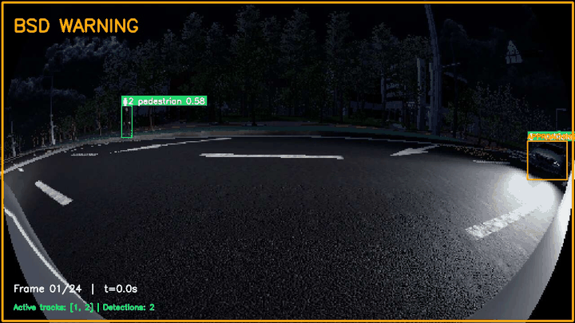

# 🚗 BSDSystem — Night-time Blind Spot Detection

**What:** 우측 사각지대 차량·보행자 감지 + 3-stage 접근 경보

**Stack:** SGLDet + YOLOv8m + SORT + ROS2 + MORAI 시뮬

**Result:** in-domain test mAP@0.5 = 63.5 % (vehicle 96.3 %, pedestrian 30.8 %)

---

## ✨ Highlights

- 🌙 **Low-Light Detection** — SGLDet (ICLR 2026) framework with SCI Enhancer + SDAP Denoiser + Fourier Fusion
- 🎯 **3-Stage Dynamic Alert** — `SAFE` / `WARNING` / `DANGER` based on relative approach velocity (not just zone presence)
- 🔁 **SORT Tracking** — ID consistency across frames, IoU greedy matching with Kalman fallback
- 📐 **Fisheye Geometry** — Equidistant projection model for MORAI 179° FOV cameras, accurate ground-plane back-projection
- 🤖 **ROS2 + MORAI** — Real-time inference node, rosbridge integration

---

## 🏗 System Architecture

```
┌──────────────────────────────────────────────────────────────────────┐
│                         Training (Part A)                             │
├──────────────────────────────────────────────────────────────────────┤
│                                                                       │
│  MORAI Simulator                                                      │
│       │                                                               │
│       ▼                                                               │
│  ┌────────────┐    ┌────────────┐    ┌────────────────┐              │
│  │   Image    │───►│   YOLOv8m  │───►│  Detection     │              │
│  │  (fisheye) │    │   Backbone │    │  Loss (L_det)  │              │
│  └─────┬──────┘    └────────────┘    └────────────────┘              │
│        │                                                              │
│        ├──► SCI Enhancer ─┐                                           │
│        │                  ├──► Fourier Fusion ──► Aux Decoder        │
│        └──► SDAP Denoiser ┘                            │              │
│                                              ┌─────────▼─────────┐    │
│                                              │ Self-Supervised   │    │
│                                              │   Loss (L_self)   │    │
│                                              └───────────────────┘    │
│                  L_total = L_det + λ · L_self    (λ = 0.01)           │
└──────────────────────────────────────────────────────────────────────┘

┌──────────────────────────────────────────────────────────────────────┐
│                       Inference (Part B)                              │
├──────────────────────────────────────────────────────────────────────┤
│                                                                       │
│   Camera Frame                                                        │
│        │                                                              │
│        ▼                                                              │
│  ┌─────────────┐   ┌──────────┐   ┌───────────┐   ┌──────────────┐  │
│  │   YOLOv8m   │──►│   SORT   │──►│  Fisheye  │──►│   BSD Logic  │  │
│  │  Detection  │   │  Tracker │   │   Back-   │   │  (3-stage)   │  │
│  │  (lightweight)  │  (ID)    │   │ Projection│   │   alert      │  │
│  └─────────────┘   └──────────┘   └───────────┘   └──────┬───────┘  │
│                                                            │          │
│                                       ┌────────────────────▼────┐    │
│                                       │  SAFE / WARNING /       │    │
│                                       │  DANGER  →  Visualizer  │    │
│                                       └─────────────────────────┘    │
└──────────────────────────────────────────────────────────────────────┘
```

---

## 🎬 Demo



> **MORAI live capture (13 frames @ 0.5 s = 5.2 s).** 자차 우측 후방에서 NPC 차량이 점진 가속하며 BSD zone 으로 진입 → 접근 속도가 0.2 m/s 에서 1.6 m/s 로 급증 → DANGER 경보 7 frame 지속 → 차량이 자차를 통과한 뒤 zone 이탈.

```
frame 1 ~ 2   🟡 WARNING   approach = +0.0 → +0.2 m/s   (zone 진입, 임계 미만)
frame 3 ~ 9   🔴 DANGER    approach = +0.5 → +1.6 m/s   (강한 가속 접근 ⚠)
frame 10~13   🟢 SAFE      차량이 자차 통과, zone 이탈
```

```
🟢 SAFE     │ Zone 밖
🟡 WARNING  │ Zone 안 + 정적 / 멀어짐
🔴 DANGER   │ Zone 안 + 접근 중 (Δx/Δt > 0.3 m/s)
```

> Track #1 가 9 frame 동안 같은 ID 를 유지 — SORT 가 안정적으로 추적. frame 10 부터 자차 통과로 detection 이 자연 종료.
>
> Reproduce: `python3 scripts/demo_tracker.py --data-root data/morai_demo --condition night --seq-idx 0 --fps 2`

---

## 📐 BSD Zone (ISO 17387 LCDAS-inspired)

```
        ┌──────────────┐
        │              │
        │   Ego Car    │       Camera mount: x=2.15, y=±0.9, z=0.55 (m)
        │  ┌────────┐  │       FOV: 179° fisheye (equidistant)
        │  │ Driver │  │
        │  └────────┘  │
        │              │
        ├──────────────┤  ← B-pillar
        │              │
        ▼              ▼
                       :::::::::::::::
                       :  BSD Zone    :   lateral : 0.5 – 3.5 m
                       :              :   forward : 0 – 2.5 m
                       :  Dynamic     :   rear    : 0 – 5.0 m
                       :  approach    :
                       :  detection   :
                       :::::::::::::::
```

---

## 🚀 Quick Start

### 1. Environment

```bash
git clone https://github.com/<your-id>/BSDSystem.git
cd BSDSystem
python -m venv .venv
source .venv/bin/activate   # Windows: .venv\Scripts\activate
pip install ultralytics opencv-python torch pyyaml numpy albumentations filterpy lap
```

> ROS2 inference 사용 시: `rclpy`, `cv_bridge`, `morai_msgs` 추가 설치 필요

### 2. Data Collection (MORAI + rosbridge)

```bash
# rosbridge
ros2 run rosbridge_server rosbridge_websocket

# GT-based collector (no YOLOv8 auto-label — 야간 오탐 회피)
python3 collect_data.py --condition night --auto --interval 0.5
python3 collect_data.py --condition dusk  --auto --interval 0.5
```

### 3. Augmentation (Albumentations-based)

```bash
python3 augment_data.py --condition night --n-aug 5 --yes
python3 augment_data.py --condition dusk  --n-aug 5 --yes
```

### 4. Training

```bash
# 본 학습 (pretrain 포함, ~10시간)
python3 main.py --mode train --epochs 100 --batch 8 --pretrain

# 끊긴 후 재개
python3 main.py --mode train --epochs 100 --batch 8 --resume
```

### 5. Evaluation

```bash
# In-domain test set (학습 후 새로 수집한 시나리오, 60장)
python3 scripts/evaluate_map_newdata.py --data-root data/morai_test
```

### 6. Inference

```bash
# 정적 BSD 데모 (학습 데이터 샘플)
python3 scripts/demo_bsd.py --condition night --mix-size --n 12

# 동적 SORT + 3-stage Alert 데모
python3 scripts/demo_tracker.py --condition night --seq-idx 1

# 실시간 영상 추론
python3 main.py --mode run --source demo.mp4

# ROS2 + MORAI 실시간
ros2 launch bsd_deepnight bsd_detector.launch.py \
    weights:=$(pwd)/checkpoints/best_model.pt
```

---

## 📈 Results

### Training Outcome

| Metric | Value |
|---|---|
| Best val loss (epoch 46) | **18.67** |
| Training duration | ~10 h on RTX 4070 Laptop |
| Early stopping rationale | val plateau for 23 epochs |

### mAP Evaluation (In-domain Test Set)

학습 후 새로 수집한 60장 (night 30 + dusk 30, 같은 맵 / 다른 NPC 시나리오) 으로 측정.

| Metric | Value |
|---|---|
| mAP@0.5         | **63.5 %** |
| mAP@0.5:0.95    | 48.8 %     |
| Precision       | 96.0 %     |
| Recall          | 54.3 %     |
| F1              | 69.3 %     |

| Class | AP@0.5 | AP@0.5:0.95 | Precision | Recall |
|---|---|---|---|---|
| Vehicle    | **96.3 %** | 77.8 % | 91.9 % | **92.7 %** |
| Pedestrian | 30.8 %     | 19.7 % | **100 %** | 15.9 % |

> Vehicle 인식은 BSD 핵심 use-case 신뢰 가능 수준 (AP 96 %). Pedestrian 은 Precision 100 % 라 잡았을 때 항상 맞지만 Recall 15.9 % — 야간 + fisheye + 작은 객체 조합에서 mis-detection 이 많음.

### Inference Speed (RTX 4070 Laptop)

| Stage | Latency |
|---|---|
| Pre-process    | 0.4 ms |
| Detection      | 7.0 ms |
| Post-process   | 0.4 ms |
| SORT update    | <1 ms |
| **End-to-end** | **~8 ms (≈ 125 FPS)** |

---

## 📁 Project Structure

```
BSDSystem/
├── configs/
│   ├── camera_config.yaml      # Fisheye intrinsic/extrinsic + BSD zone (ISO 17387)
│   └── sgldet_config.yaml      # Hyperparameters (lr, epochs, λ_self, etc.)
├── src/
│   ├── datasets/morai_dataset.py    # YOLO loader, train/val split, collate
│   ├── inference/
│   │   ├── detector.py              # SGLDet lightweight inference (YOLOv8 core)
│   │   └── bsd_interface.py         # SORT integration + BSD zone judgment
│   └── preprocessing/
│       ├── calibration.py           # Fisheye undistortion (optional)
│       └── coord_transform.py       # Equidistant back-projection → vehicle frame
├── models/
│   ├── sgldet_yolov8.py             # SGLDet framework (SCI + SDAP + Fourier)
│   └── sort_tracker.py              # SORT wrapper (IoU greedy / filterpy)
├── ros2_ws/src/bsd_deepnight/       # ROS2 inference node + launch file
├── scripts/
│   ├── evaluate_map_newdata.py     # In-domain test mAP (fresh data)
│   ├── demo_bsd.py                  # Static image BSD demo
│   └── demo_tracker.py              # SORT + 3-stage alert demo
├── collect_data.py                  # MORAI GT-based collector (rosbridge)
├── augment_data.py                  # Albumentations night-aware augmentation
├── train.py                         # SGLDet training (pretrain + main + resume)
└── main.py                          # Unified entry (train / run)
```

---

## ⚠️ Limitations & Future Work

| Limitation | Mitigation |
|---|---|
| **Data scarcity** — 902 originals from few MORAI locations | 실차 데이터 5,000+ 확보, 다양한 도시/시간 |
| **Sim2Real gap** — 합성 데이터에서 학습, 실차에서 동작 미검증 | Domain adaptation (e.g., GTA→KITTI proxy), TTA |
| **Pedestrian detection at night** — 야간 + fisheye + 작은 객체 조합에서 recall 낮음 | Stronger augmentation, larger backbone (YOLOv8x), 야간 보행자 합성 데이터 증강 |
| **Single right-side BSD camera** | Symmetric left BSD node 추가, dual-camera fusion |
| **No vehicle speed input** | Ego speed (`/Ego_topic`) 활용한 상대 속도 정밀화 |

---

## 🎓 Lessons Learned

본 프로젝트를 진행하며 직접 부딪힌 5가지.

### 1. Loss curve lies — 학습 곡선은 거짓말한다
val_loss 가 18.67 까지 부드럽게 떨어졌어도 mAP 가 실제 성능을 보장하지 않는다. Loss 는 학습 가이드일 뿐 성능 증명이 아니다.
> **Rule:** 학습 시작 *전*에 mAP / F1 측정 파이프라인을 만들어 둔다. 매 epoch 평가 metric 도 같이 봐야 "잘 학습된 멍청한 모델" 을 피한다.

### 2. Random split is not random — 시계열에서 셔플은 정보 누설이다
0.5 초 간격 frame, 같은 시나리오, 같은 NPC — random shuffle 하면 train/val 양쪽에 거의 같은 frame 이 흩어져 모델이 외운다. Random split 이 inflated 결과를 만드는 전형적인 사례.
> **Rule:** Sequential / sensor 데이터엔 random split 금지. Scenario / time / location 단위 split + 누수 검증 스크립트 필수.

### 3. Pretrained weights do 90 % of the work — 사전학습이 결과의 90 % 다
YOLOv8m + COCO pretrained 가 첫 epoch 부터 vehicle 87 % 신뢰도로 검출했다. 902 장 fine-tune 은 미세 보정이지, 모델을 처음부터 학습시킨 게 아니다.
> **Rule:** 작은 데이터셋 (< 5,000) 의 학습 결과는 ablation (no-pretrain vs pretrain) 으로 contribution 분리 측정. 안 그러면 "내 모델" 의 성능이 아니라 "COCO 의 성능" 을 말하게 된다.

### 4. Simulation domain ≠ Reality — 합성 데이터는 시뮬레이터를 학습한다
MORAI 에서 잘 작동해도 실차에선 도메인 갭이 크다. 모델이 학습한 건 "차량" 보다 "MORAI 렌더러의 폴리곤 + 텍스처 + 조명 모델" 에 가깝다.
> **Rule:** 합성 데이터는 알고리즘 프로토타입 검증용. 실운용은 실차 데이터로 검증. 시뮬레이션 수치를 실제 성능으로 발표할 땐 도메인 갭을 명시.

### 5. End-to-end performance ≠ Sum of part metrics — 시스템 성능은 모델 metric 의 합이 아니다
Detection mAP 만 보면 약점이 두드러져도, SORT tracking + zone logic + 3-stage alert 가 결합되면 시스템 차원에서 false positive 가 시간적으로 안정화되며 쓸 만한 결과가 나온다.
> **Rule:** 단일 모델 metric (mAP, F1) 대신 input → final output 의 end-to-end 평가가 시스템 가치를 보여준다.

---

## 📚 References

1. **SGLDet** — *Self-Guided Low-Light Object Detection Framework*, ICLR 2026
2. **YOLOv8** — Ultralytics, 2023 ([github.com/ultralytics/ultralytics](https://github.com/ultralytics/ultralytics))
3. **SORT** — Bewley et al., *Simple Online and Realtime Tracking*, ICIP 2016
4. **ISO 17387** — Lane Change Decision Aid Systems (LCDAS) — Performance requirements
5. **MORAI Simulator** — [www.morai.ai](https://www.morai.ai)
